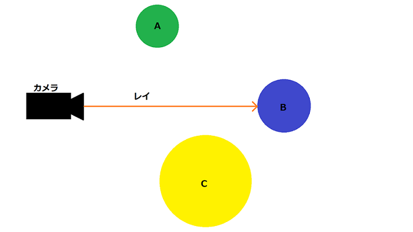
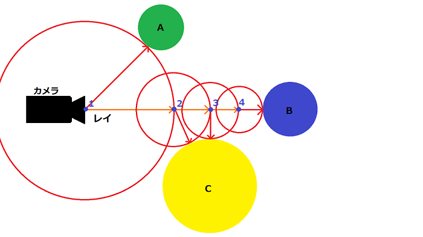
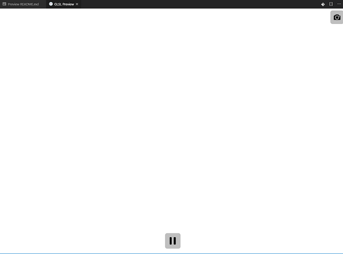
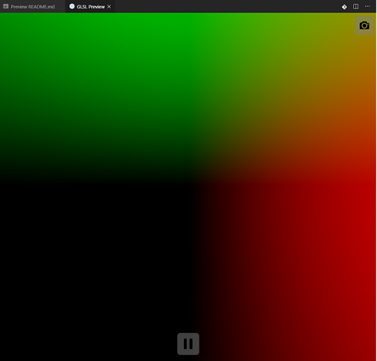
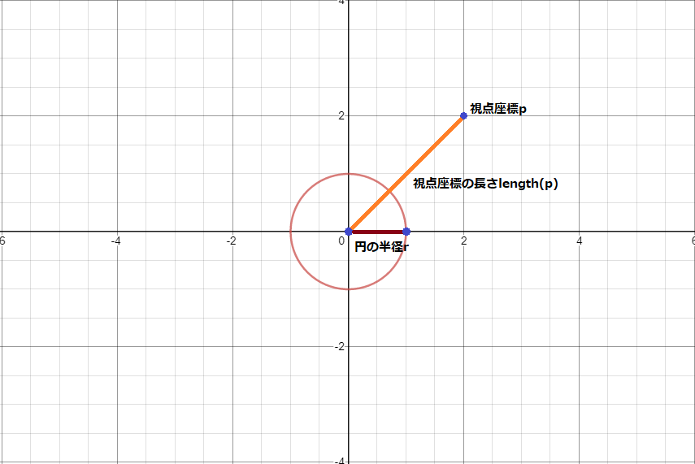
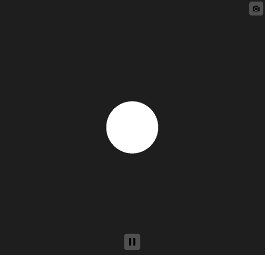
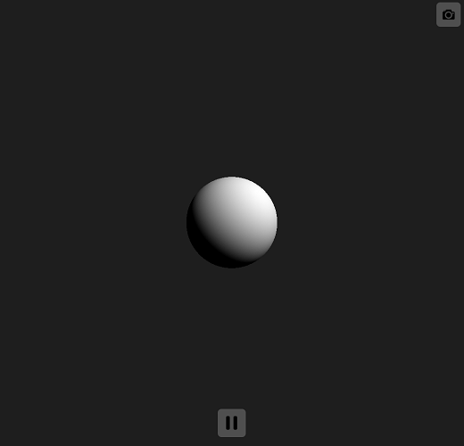
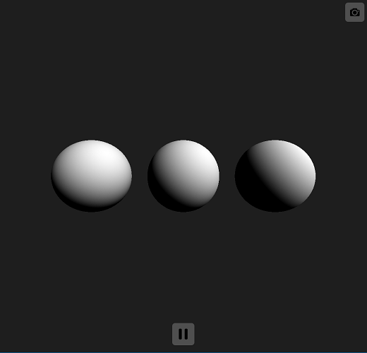

<!---レイマーチングに関しての説明--->

# レイマーチングによるプリミティブの描画  

## はじめに  

  レイマーチングとは[レイトレーシング](https://ja.wikipedia.org/wiki/レイトレーシング)と呼ばれるレンダリング技法の一つです。  
  一般的なラスタライズ法 レイトレース法とは違ってポリゴンを使用せず[^1]、  
  "距離関数"と呼ばれる数式をもとにピクセルシェーダーでオブジェクトをレンダリングするのが特徴。  
  上記特徴により他のレンダリング法では難しいオブジェクトの変形や合成を得意としていて、  
  [このような](https://www.youtube.com/watch?v=z_xM_jD08OM)ものをコードオンリーで描画することができる。(ただし複雑なオブジェクトは描画負荷がかなり大きい)  
  
[^1]: ピクセルシェーダーを動作させる必要があるので最低限の板ポリゴンは使用する

## レイマーチングの概念について  

  レイマーチングの実装に関して説明をする前にレイトレーシングに関して少し確認します。  
  レイトレーシングは図00のようにカメラ(視点)からある一点に対してレイを飛ばし、  
  オブジェクトと衝突しているかどうかを計算します。  
  衝突されていると判断された場合は描画され/そうでない場合は何もしません。  
  これが基本的なレイトレーシングの考えた方になります[^2]。  

  図00
    

  レイマーチングに関してもレイを飛ばすのですが、飛ばし方が基本的なレイトレーシングと異なっていて、  
  少しわかりづらいですが図01見ていただくと、レイを段階的に飛ばしているかと思います。  
  レイマーチングは視点から一番近いオブジェクトとの距離を求めその距離分だけレイを進めています。  
  この一連の流れを何度も繰り返すことで最終的にオブジェクトとの距離がほぼ0となり衝突していると判断して描画する。  
  これがレイマーチングの考え方になります。  

  図01
    

[^2]: レイトレーシングは様々な技法があるのであくまで基本的な考え方です

### レイマーチングの手順まとめ  

  1. 視点座標pを用意する  
  2. 視点座標pと最も近いオブジェクトとの距離rを求める  
  3. 距離rをもとにpを更新する  
  4. 1-3の手順を繰り返す  
  5. 距離rが0に限りなく近づいている状態ならば衝突していると判断して描画(この手順をピクセル数繰り返す)

## 実際にコードで書いてみる  

  これ以上は説明するよりも実際のコードを見るほうが理解しやすいと思うので早速書きましょう。  
  環境に関しては[こちら](../README.md)で記載した通りです。

### ShaderToyの基本  

  とりあえず"Shader Toy"環境において最小となるコードに関して説明したいと思います。  
  VSCode上で"main.glsl"[^3]を作成して下記のコードを書いて、  
  Ctrl+Shift+Pでコマンドパレットを開き"Shader Toy: Show GLSL Preview"を実行します。  
  警告などなく"GLSL Preview"というタブで図03真っ白な画面が出れば成功です(図03)。  

  ```glsl
  // エントリ関数
  void mainImage(out vec4 fragColor, in vec2 fragCoord) {
    fragColor = vec4(1.0);
  }
  ```

  さらっとコードに関して解説すると"mainImage()"はピクセルシェーダーのエントリです。  
  ピクセルの数だけこの処理が実行されます。(RayMarchingはこの関数内で行います)  
  出力引数"fragColor"はピクセルの最終出力カラー値(RGBA)です。  
  　(このコードではvec4(1.0)を設定しているので画面全体が真っ白になります)  
  入力引数"fragCoord"は現在のピクセル座標が格納されています。  

  図03  
    
  
  [^3]: 拡張子が.glslならファイル名は何でもいいです

### レイの生成  
  
  次は上記コードをもとにピクセルシェーダー内でレイを生成してみます。  
  下記コードを先ほどと同様に"main.glsl"に書いて実行しましょう。  
  x方向が赤くてy方向が緑になっている図04画面が出れば成功です(図04)。  
  
  ```glsl
  // エントリ関数
  void mainImage(out vec4 fragColor, in vec2 fragCoord) {
    vec2 pixelPos = (fragCoord.xy * 2. - iResolution.xy) / min(iResolution.x, iResolution.y); // 原点を画面中心に

    vec3 cameraPos  = vec3( 0.0,  0.0,  5.0); // カメラ座標
    vec3 cameraDir  = vec3( 0.0,  0.0, -1.0); // カメラ向き
    vec3 cameraUp   = vec3( 0.0,  1.0,  0.0); // カメラ上方向ベクトル
    vec3 cameraSide = cross(cameraDir, cameraUp); // 横方向ベクトル

    // ピクセル座標に対応したレイを生成
    vec3 ray = normalize(cameraSide * pixelPos.x + cameraUp * pixelPos.y + cameraDir);

    fragColor = vec4(ray.xyz, 1.0);
  }
  ```

  上記コードはレイを生成してレイのベクトルをカラー値として出力しています。  
  短いコードですが気になる点としてはpixelPosの計算と急に出てきたiResolutionに関してですね。こちらについて解説します。  
  まずiResolutionに関してですが名前通り解像度が格納されているグローバルの定数です。"Shader Toy"の機能として提供されています。  
  それを踏まえたうえでpixelPosの計算を見るとコメント通り原点を画面中心としていることがわかるかと思います。  
  　(画面上のピクセル座標.xy * 2 - 画面解像度.xy) / min(画面解像度x, 画面解像度y)  
  そのあとは計算しなおしたpixelPosとカメラの設定[^4]からレイを生成してカラー値に出力しています。  
  これでようやくレイマーチングを行う準備が整いました。  

  図04  
    

  [^4]: 右手座標系なのでZ(カメラの向き)だけマイナス方向なことだけ注意
  
### 距離関数と描画  

  さてさっそくレイを飛ばしたいのですが、レイマーチングは視点座標と一番近いオブジェクトとの距離を求めてレイを進めていくので、  
  オブジェクトとの距離を求める関数(距離関数)を定義する必要があります。  
  以下のコードが一番単純な球体の距離関数です。

  ```glsl
  // 球体の距離関数
  float dfSphere(vec3 p, float r) {
    return length(p) - r;
  }
  ```

  上記のコードを読み解く際に球体は原点にある前提で考えてください。  
  引数"vec3 p"は視点座標 "float r"は球体の半径 返り値は球体との距離になります。  
  length()で原点から視点座標の距離を求めた後、球体の半径を引くことで球体との距離を求めれることが図05を見て想像できると思います。  
  
  図05  
    

  では上記の距離関数の説明を踏まえて球体の描画を行いたいと思います。  
  今度は下記コードを書いて実行してみましょう。  
  真っ白な球体が画面中央に描画されれば成功です(図06)。  

  ```glsl
  #define MAX_VALUE 1e10
  #define EPSILON 0.00001
  #define MARCHING_LOOP 128

  // 球体の距離関数
  float dfSphere(vec3 p, float r) {
    return length(p) - r;
  }

  // 距離関数
  float map(vec3 p) {
    float result = MAX_VALUE;
    result = dfSphere(p, 1.);
    return result;
  }

  // エントリ関数
  void mainImage(out vec4 fragColor, in vec2 fragCoord) {
    vec2 pixelPos = (fragCoord.xy * 2. - iResolution.xy) / min(iResolution.x, iResolution.y); // 原点を画面中心に

    vec3 cameraPos  = vec3( 0.0,  0.0,  5.0);   // カメラ座標
    vec3 cameraDir  = vec3( 0.0,  0.0, -1.0);   // カメラ向き
    vec3 cameraUp   = vec3( 0.0,  1.0,  0.0);   // カメラ上方向ベクトル
    vec3 cameraSide = cross(cameraDir, cameraUp); // 横方向ベクトル

    // ピクセル座標に対応したレイを生成
    vec3 ray = normalize(cameraSide * pixelPos.x + cameraUp * pixelPos.y + cameraDir);

    float rDistance = 0.0;  // レイの先端座標(rPos)とオブジェクトの距離
    float rLen = 0.0;       // カメラ座標からレイの先端座標までの距離
    vec3 rPos = cameraPos;  // レイの先端座標

    // マーチングループ
    vec4 result = vec4(0.0);
    for (int i = 0; i < MARCHING_LOOP; i++) {
      rPos = cameraPos + ray * rLen;  // レイを伸ばしてレイの先端座標を更新
      rDistance = map(rPos);  // 距離関数でオブジェクトとの距離を取得

      // 衝突判定(距離が0に限りなく近ければ衝突したと判断)
      if (abs(rDistance) < EPSILON) {
        // カラー決定
        result = vec4(1.0);
        break;
      }

      rLen += rDistance;  // レイの長さを更新
    }

    fragColor = result;
  }
  ```

  コード自体はシンプルです。解説すべき点としてはマーチングループを行っている箇所でしょうか。  
  
  マーチングループは先ほどの説明にもあったレイを段階的に延ばしている部分になります。  
  定数として定義している"MARCHING_LOOP"の回数レイを伸ばしています。(この値が大きければ大きいほど精度が上がりますが処理時間も顕著に遅くなります)  
  距離が定数"EPSILON"よりも小さくなれば衝突していると判断してカラー値を白にしています。  

  図06  
    

### 法線とライティング  

  先の項目でようやく球体が描画できましたが真っ白なだけでは流石に物足りません。  
  今度は距離関数から法線を生成してライティングを行いたいと思います。  
  
  まずは法線の生成方法のコードになります。  
  
  ```glsl
  // 法線生成関数
  vec3 mapNormal(vec3 p) {
    return normalize(
        vec3(
            map(p + vec3(EPSILON, 0.0,     0.0    )) - map(p + vec3(-EPSILON,  0.0,      0.0    )),
            map(p + vec3(0.0,     EPSILON, 0.0    )) - map(p + vec3( 0.0,     -EPSILON,  0.0    )),
            map(p + vec3(0.0,     0.0,     EPSILON)) - map(p + vec3( 0.0,      0.0,     -EPSILON))));
  }
  ```
  
  何してるかわかんないですね。  
  一言でいうとこのコードは距離関数"map(x, y, z)"を偏微分して法線ベクトルを求めてます。  
  詳しくは説明できないのですが、関数の各成分を偏微分して並べたベクトルを勾配ベクトルと呼び、  
  陰関数の勾配ベクトルは法線として扱うことができます。  
  詳しく知りたい方は「ベクトル解析 勾配」や「ベクトル解析 法線」等で調べていただければ出てくると思います。  

  法線を求めることができたので次はライティングを行います。  
  ライティングは手っ取り早くランバート拡散照明を使用します。  

  ```glsl
  vec3 lightDir = normalize(vec3(1.0, 1.0, 1.0));
  vec3 lightColor = vec3(1.0);
  result = vec4(max(dot(lightDir, mapNormal(rPos)), 0.0) * lightColor, 1.0);
  ```

  特筆すべきことはないライティングです。  
  上記処理を組み込んだのが以下コードです。図07の見た目になれば成功です。  

  ```glsl
  #define MAX_VALUE 1e10
  #define EPSILON 0.00001
  #define MARCHING_LOOP 128

  // 球体の距離関数
  float dfSphere(vec3 p, float r) {
    return length(p) - r;
  }

  // 距離関数
  float map(vec3 p) {
    float result = MAX_VALUE;
    result = dfSphere(p, 1.);
    return result;
  }

  // 法線生成関数
  vec3 mapNormal(vec3 p) {
    return normalize(
        vec3(
            map(p + vec3(EPSILON, 0.0,     0.0    )) - map(p + vec3(-EPSILON,  0.0,      0.0    )),
            map(p + vec3(0.0,     EPSILON, 0.0    )) - map(p + vec3( 0.0,     -EPSILON,  0.0    )),
            map(p + vec3(0.0,     0.0,     EPSILON)) - map(p + vec3( 0.0,      0.0,     -EPSILON))));
  }

  // エントリ関数
  void mainImage(out vec4 fragColor, in vec2 fragCoord) {
    vec2 pixelPos = (fragCoord.xy * 2. - iResolution.xy) / min(iResolution.x, iResolution.y); // 原点を画面中心に

    vec3 cameraPos  = vec3( 0.0,  0.0,  5.0);   // カメラ座標
    vec3 cameraDir  = vec3( 0.0,  0.0, -1.0);   // カメラ向き
    vec3 cameraUp   = vec3( 0.0,  1.0,  0.0);   // カメラ上方向ベクトル
    vec3 cameraSide = cross(cameraDir, cameraUp); // 横方向ベクトル

    vec3 lightDir = normalize(vec3(1.0, 1.0, 1.0));
    vec3 lightColor = vec3(1.0);

    // ピクセル座標に対応したレイを生成
    vec3 ray = normalize(cameraSide * pixelPos.x + cameraUp * pixelPos.y + cameraDir);

    float rDistance = 0.0;  // レイの先端座標(rPos)とオブジェクトの距離
    float rLen = 0.0;       // カメラ座標からレイの先端座標までの距離
    vec3 rPos = cameraPos;  // レイの先端座標

    // マーチングループ
    vec4 result = vec4(0.0);
    for (int i = 0; i < MARCHING_LOOP; i++) {
      rPos = cameraPos + ray * rLen;  // レイを伸ばしてレイの先端座標を更新
      rDistance = map(rPos);  // 距離関数でオブジェクトとの距離を取得

      // 衝突判定(距離が0に限りなく近ければ衝突したと判断)
      if (abs(rDistance) < EPSILON) {
        // カラー決定
        result = vec4(max(dot(lightDir, mapNormal(rPos)), 0.0) * lightColor, 1.0);
        break;
      }

      rLen += rDistance;  // レイの長さを更新
    }

    fragColor = result;
  }
  ```

  図07  
    

### 複数オブジェクトの描画

  ライティングした球体を描画できたので今度は複数のオブジェクトを描画してみましょう。  
  複数オブジェクトの描画は簡単で距離関数の呼び出しを増やすだけですね。  
  ただ呼び出すだけでなく、距離関数の帰り値を比較してどのオブジェクトが視点座標に近いかを判断する必要があります。

  ```glsl
  // 距離比較
  float dfCompare(float a, float b) {
    return (a < b) ? a : b;
  }

  // 距離関数
  float map(vec3 p) {
    float result = MAX_VALUE;
    result = dfCompare(result, dfSphere(p + vec3(-2.5, 0, 0), 1.0));
    result = dfCompare(result, dfSphere(p + vec3( 0.0, 0, 0), 1.0));
    result = dfCompare(result, dfSphere(p + vec3( 2.5, 0, 0), 1.0));
    return result;
  }
  ```

  行っているのは距離を比較する"dfCompare"の追加と"map"の改造になります。  
  "dfCompare"は与えられた値を比較して小さいほうを返すだけの単純な作りです。  
  
  "map"内の改造は"dfSphere"の呼び出しと"dfCompare"による距離比較を追加しただけですが、  
  よく見ると"dfSphere"の呼び出しの際にx値に変更をかけているのがわかるかと思います。  
  これは特定の距離関数呼び出しの際に視点座標にオフセットを加えることで、オブジェクトの位置を動かしている処理になります。  

  上記コードを組み込み図08の見た目になれば成功です。  
  
  図08  
    

### まとめ  

  ここまで来たらレイマーチングの処理の流れや雰囲気などがなんとなくつかめてきたのではないでしょうか。  

  今回触っていただいたレイマーチングの使用実績ですが、DemoScene界隈(4k/64k Intro)がほとんどだと思います。  
  ゲームでも限定的ではありますが下記のような実績があります。  
  某空戦ゲーム  
  　ミドルウェア"TrueSky"がレイマーチングを使用している(空のライティングや雲の表現等？)  
  某RPGゲーム  
  　雲海の表現にレイマーチングを使用  

  またレイマーチングにおいて一番重要な要素であるオブジェクトの合成/変形などがありますが、  
  これ以上は長くなるのでまた別の項目で説明したいと思います。  

<!---memo集--->

# memo  
  
<!---GLSLテストが可能なウェブサイト--->

## GLSLテストが可能なウェブサイト  

  1. [Shader Toy](https://www.shadertoy.com)  
        シェーダーコーディング界の凄い人iq氏が作ったサイト  
        GLSLコーディングができるサイトで一番メジャー所(だと思う)  
        クオリティが高い作品や面白いものが多いのでサーフィンするだけでも楽しい  

  1. [GLSL Sandbox](http://glslsandbox.com/)  
        three.jsの作者(mrdoob氏)が作ったサイト  
        基本機能は"Shader Toy"とほぼ一緒だがブラウズ機能が個人的に使いづらいのと作品が多いので目当てのものが探しづらいイメージ  
        最初に触ってみる分には敷居が低いほうだと思う  

  1. [vertexshaderart](https://www.vertexshaderart.com/)  
        "Shader Toy"と"GLSL Sandbox"とは別に頂点シェーダーに特化したサイト  
        RayMarchingは書けないがこんなのもあるんだなくらいに

  1. [Shdr Editor](http://shdr.bkcore.com/)  
        頂点シェーダーとピクセルシェーダー両方書けるサイト  
        使ったことはないのでよくわからない  

<!---
  memo
  [iq live](http://iquilezles.org/live/index.htm)  
  [qiitaでみっけたやつ](https://qiita.com/doxas/items/5a7b6dedff4bc2ce1586)  
  [RayMarchingの図解](https://www.praph.tokyo/tags/Raymarching)  

  環境に関して
  レイマーチングを触る際はシェーダー以外のコードは手間でしかないので、GLSLのテストが可能な環境またはサイトを使用することをおすすめする。  
  こちらでは["Visual Studio Code - Shader Toy"](https://marketplace.visualstudio.com/items?itemName=stevensona.shader-toy)という、"VSCode"上で"Shader Toy"と同様のLivePreview機能を追加する拡張を使用している。
--->
