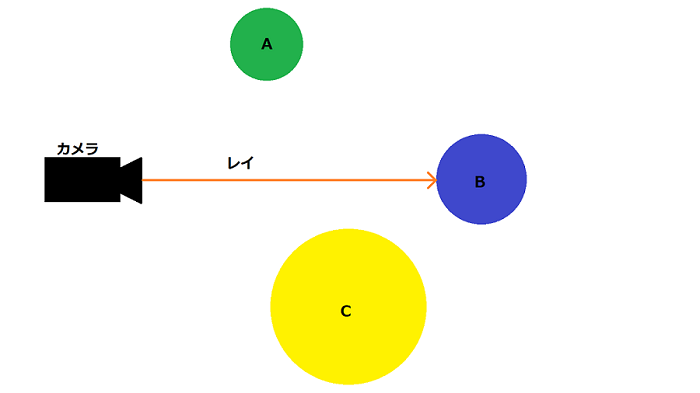
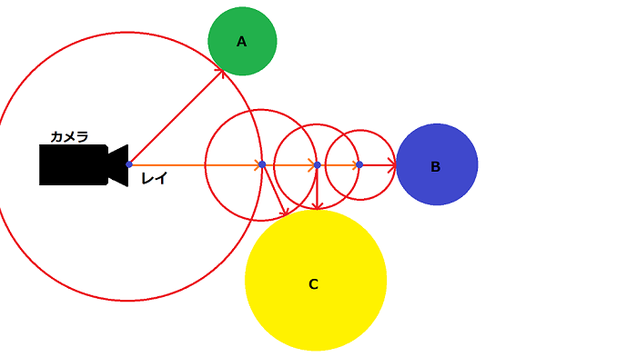

<!---レイマーチングに関しての説明等--->

# レイマーチング  

<!---
説明の順序
1.レイマーチングについて
2.レイマーチングの実装方法(距離関数)
3.レイマーチングの利点/欠点
4.実績(DemoSceneでよくつかわれていること+ゲームでも限定的に使われること)
5.サンプル交えて実装
--->

## はじめに  

  レイマーチングとは[レイトレーシング](https://ja.wikipedia.org/wiki/レイトレーシング)と呼ばれるレンダリング技法の一つ。  
  一般的なラスタライズ法 レイトレース法とは違いポリゴンを使用せず[^1]、"距離関数"と呼ばれる数式をもとにしてピクセルシェーダーでオブジェクトをレンダリングするのが特徴。  
  上記特徴によって他のレンダリング法では難しい、オブジェクトの変形や合成を得意としていて[このような]())ものをコードオンリーで描画できる。(ただし描画負荷はかなり大きい)  
  
[^1]: ピクセルシェーダーを動作させる必要があるので最低限の板ポリゴンは使用する

## レイマーチングの概念について  

  レイマーチングの実装に関して説明をする前にレイトレーシングに関して少し確認します。  
  レイトレーシングは図00のように、カメラ(視点)からある一点に対してレイを飛ばしてオブジェクトと衝突しているかどうかを計算します。  
  衝突されていると判断された場合は描画され/そうでない場合は何もしません。  
  これが基本的なレイトレーシングの考えた方になります[^2]。  

  図00
    

  レイマーチングに関してもレイを飛ばすのですが、飛ばし方が基本的なレイトレーシングと異なっていて、  
  少しわかりづらいですが図01見ていただくと、レイを段階的に飛ばしているかと思います。  
  レイマーチングは視点から一番近いオブジェクトとの距離を求めその距離分だけレイを進めています。  
  この一連の流れを何度も繰り返すことで最終的にオブジェクトとの距離がほぼ0となり衝突していると判断して描画する。  
  これがレイマーチングの考え方になります。  

  図01
    

### レイマーチングの手順まとめ  

  1. 視点座標pを用意する  
  2. 視点座標pと最も近いオブジェクトとの距離rを求める  
  3. 距離rをもとにpを更新する  
  4. 1-3の手順を繰り返す  
  5. 距離rが0に限りなく近づいている状態ならば衝突していると判断して描画(この手順をピクセル数繰り返す)

[^2]: レイトレーシングは様々な技法があるのであくまで基本的な考え方です

## 実際にコードで書いてみる  

  これ以上は説明するよりも実際のコードを見るほうが理解しやすいと思うので早速書きましょう。  
  環境に関しては[こちら](../README.md)で記載した通りです。

### 最小のコード  

  とりあえず"Shader Toy"環境においての最小のglslファイルから作成します。
  VSCode上で"main.glsl"[^3]を作成して以下のコードを書いて。  
  Ctrl+Shift+Pでコマンドパレットを開き"Shader Toy: Show GLSL Preview"を実行します。  
  (警告などなく"GLSL Preview"というタブで真っ白な画面が出れば成功です)

  ```glsl
  
  // エントリ関数
  void mainImage(out vec4 fragColor, in vec2 fragCoord) {
    fragColor = vec4(1.0);
  }

  ```

  さらっとコードに関して解説すると"mainImage()"はピクセルシェーダーのエントリです。  
  ピクセルの数だけこの処理が実行されます。
  出力引数"fragColor"はピクセルの最終出力カラー値(RGBA)です。(このコードではvec4(1.0)を設定しているので画面全体が真っ白になります)  
  入力引数"fragCoord"は現在のピクセル座標が格納されています。

  [^3]: 拡張子が.glslならファイル名は何でもいいです

<!---memo集--->

# memo  
  
<!---GLSLテストが可能なウェブサイト--->

## GLSLテストが可能なウェブサイト  

  1. [Shader Toy](https://www.shadertoy.com)  
        シェーダーコーディング界の凄い人iq氏が作ったサイト  
        GLSLコーディングができるサイトで一番メジャー所(だと思う)  
        クオリティが高い作品や面白いものが多いのでサーフィンするだけでも楽しい  

  1. [GLSL Sandbox](http://glslsandbox.com/)  
        three.jsの作者(mrdoob氏)が作ったサイト  
        基本機能は"Shader Toy"とほぼ一緒だがブラウズ機能が個人的に使いづらいのと作品が多いので目当てのものが探しづらいイメージ  
        最初に触ってみる分には敷居が低いほうだと思う  

  1. [vertexshaderart](https://www.vertexshaderart.com/)  
        "Shader Toy"と"GLSL Sandbox"とは別に頂点シェーダーに特化したサイト  
        RayMarchingは書けないがこんなのもあるんだなくらいに

  1. [Shdr Editor](http://shdr.bkcore.com/)  
        頂点シェーダーとピクセルシェーダー両方書けるサイト  
        使ったことはないのでよくわからない  

<!---
    資料作成用のメモ
    参考URL
--->

<!---
  memo
  [iq live](http://iquilezles.org/live/index.htm)  
  [qiitaでみっけたやつ](https://qiita.com/doxas/items/5a7b6dedff4bc2ce1586)  
  [RayMarchingの図解](https://www.praph.tokyo/tags/Raymarching)  

  使用実績
  DemoScene(4k/64k Intro)界隈ではかなり一般的な手法
  
  ゲームでも限定的ではあるが使用実績がある  
  某空戦ゲーム  
  　ミドルウェア"TrueSky"がレイマーチングを使用している(空のライティングや雲の表現等？)  
  某RPGゲーム  
  　雲海の表現にレイマーチングを使用  

  環境に関して
  レイマーチングを触る際はシェーダー以外のコードは手間でしかないので、GLSLのテストが可能な環境またはサイトを使用することをおすすめする。  
  こちらでは["Visual Studio Code - Shader Toy"](https://marketplace.visualstudio.com/items?itemName=stevensona.shader-toy)という、"VSCode"上で"Shader Toy"と同様のLivePreview機能を追加する拡張を使用している。

  https://www.slideshare.net/gyaboyan?utm_campaign=profiletracking&utm_medium=sssite&utm_source=ssslideview  
  https://wgld.org/d/glsl/g008.html
  http://tips.hecomi.com/entry/2016/10/11/225541
--->
