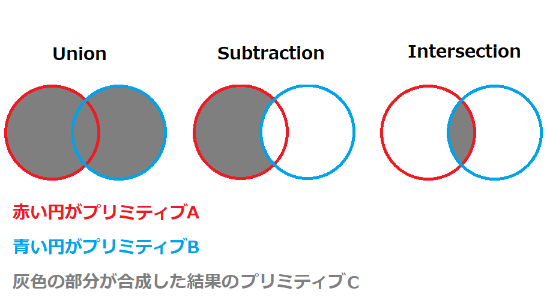
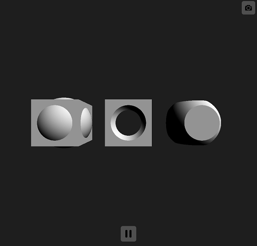

# レイマーチングによるプリミティブの合成  

## プリミティブの合成  

  こちらの資料ではプリミティブ同士の合成に関しての簡単な解説を行います。  
  [こちら](../00_Primitive/README.md)の資料に目を通している前提での説明になるので、まだ目を通していない方は確認していただければと思います。  

  通常プリミティブ同士の合成は一般的なラスタライズ法やレイトレース法で行おうとするとかなり手間がかかる処理になるかと思います。  
  ただ、こちらで解説しているレイマーチングにおいてはその限りではありません。  
  レイマーチングのプリミティブ描画はポリゴンを使用したものではなく、数式(距離関数)によって求められているものなので、プリミティブの合成や変形といった処理がとても得意です。  
  もし合成処理をマスターすることができれば、複雑なモデル(人などの有機的な物から 機械みたいな無機的な物まで)をコードベースで描画できるようになります。  

  そもそもプリミティブ同士の合成がどういったものなのかを少し説明します。  
  基本的なプリミティブの合成は大きく分けて以下の3種類があります(図00)。  

  プリミティブ同士をそのまま合成するUnion  
  プリミティブAからプリミティブBを減算するSubtraction  
  プリミティブAとBの交差している部分を求めるIntersection  
  
  図00
    

  図でも記載していますが、赤い円がプリミティブA 青い円がプリミティブB 灰色の個所が合成結果のプリミティブCになります。  

  では合成がどういったものかわかったかと思いますので、一度合成関数をコードとして起こしてみます。  

```glsl
// プリミティブの合成
float opUnion(float lhs, float rhs) {
    return min(lhs, rhs);
}

// プリミティブの合成(減算)
float opSubtraction(float lhs, float rhs) {
    return max(lhs, -rhs);
}

// プリミティブの合成(交差)
float opIntersection(float lhs, float rhs) {
    return max(lhs, rhs);
}
```

  合成処理はかなり簡潔です。  
  合成関数"opUnion" "opSubtraction" "opIntersection"はそれぞれ2つのfloat変数を引数として持っています。  
  この引数には距離関数で取得したプリミティブAの距離値とプリミティブBの距離値を入力します。  
  opUnionは入力された距離値の小さい値を返します。(これはかなり単純です)  
  opIntersectionは入力された距離値の大きい値を返します。(大きい値を返すので両プリミティブが衝突している場合しか描画されません)  
  opSubtractionはopIntersectionと同様に入力された距離値をmaxに渡しますが、このとき減算値として使用する距離値は正負を反転させます。  
  これによって減算値として使用した部分は描画されません。  
  
  上記を踏まえて球体と箱の合成を行ってみます。  
  (箱の距離関数に関しては解説したことはないのですがそういうものと思っておいてください)  
  コードは[00_Primitive](../00_Primitive/README.md)の内容を流用しています。  
  図01の結果になれば成功です。  

```glsl
#define MAX_VALUE 1e10
#define EPSILON 0.00001
#define MARCHING_LOOP 128

// 球体の距離関数
float dfSphere(vec3 p, float r) {
    return length(p) - r;
}

// ボックスの距離関数
float dfBox(vec3 p, vec3 b)
{
    vec3 q = abs(p) - b;
    return  
        length(max(q, 0.0)) +  
        min(max(q.x, max(q.y, q.z)), 0.0);
}

// プリミティブの合成
float opUnion(float lhs, float rhs) {
    return min(lhs, rhs);
}

// プリミティブの合成(減算)
float opSubtraction(float lhs, float rhs) {
    return max(lhs, -rhs);
}

// プリミティブの合成(交差)
float opIntersection(float lhs, float rhs) {
    return max(lhs, rhs);
}

// 距離比較
float dfCompare(float a, float b) {
    return (a < b) ? a : b;
}

// 距離関数
float map(vec3 p) {
    float result = MAX_VALUE;

    float sphere = 0.;
    float box = 0.;

    // 左側オブジェクト
    box    = dfBox(   p + vec3( 2.5, 0, 0), vec3(0.8, 0.8, 0.8));
    sphere = dfSphere(p + vec3( 2.5, 0, 0), 1.0);
    result = dfCompare(result, opUnion(box, sphere));

    // 中央オブジェクト
    box    = dfBox(   p + vec3( 0.0, 0, 0), vec3(0.8, 0.8, 0.8));
    sphere = dfSphere(p + vec3( 0.0, 0, 0), 1.0);
    result = dfCompare(result, opSubtraction(box, sphere));

    // 右側オブジェクト
    box    = dfBox(   p + vec3(-2.5, 0, 0), vec3(0.8, 0.8, 0.8));
    sphere = dfSphere(p + vec3(-2.5, 0, 0), 1.0);
    result = dfCompare(result, opIntersection(box, sphere));

    return result;
}

// 法線生成関数
vec3 mapNormal(vec3 p) {
    return normalize(
        vec3(
            map(p + vec3(EPSILON, 0.0,     0.0    )) - map(p + vec3(-EPSILON,  0.0,      0.0    )),
            map(p + vec3(0.0,     EPSILON, 0.0    )) - map(p + vec3( 0.0,     -EPSILON,  0.0    )),
            map(p + vec3(0.0,     0.0,     EPSILON)) - map(p + vec3( 0.0,      0.0,     -EPSILON))));
}

// エントリ関数
void mainImage(out vec4 fragColor, in vec2 fragCoord) {
    vec2 pixelPos = (fragCoord.xy * 2. - iResolution.xy) / min(iResolution.x, iResolution.y); // 原点を画面中心に

    vec3 cameraPos  = vec3( 0.0,  0.0,  5.0);   // カメラ座標
    vec3 cameraDir  = vec3( 0.0,  0.0, -1.0);   // カメラ向き
    vec3 cameraUp   = vec3( 0.0,  1.0,  0.0);   // カメラ上方向ベクトル
    vec3 cameraSide = cross(cameraDir, cameraUp); // 横方向ベクトル

    vec3 lightDir = normalize(vec3(1.0, 1.0, 1.0));
    vec3 lightColor = vec3(1.0);

    // ピクセル座標に対応したレイを生成
    vec3 ray = normalize(cameraSide * pixelPos.x + cameraUp * pixelPos.y + cameraDir);

    float rDistance = 0.0;  // レイの先端座標(rPos)とオブジェクトの距離
    float rLen = 0.0;       // カメラ座標からレイの先端座標までの距離
    vec3 rPos = cameraPos;  // レイの先端座標

    // マーチングループ
    vec4 result = vec4(0.0);
    for (int i = 0; i < MARCHING_LOOP; i++) {
        rPos = cameraPos + ray * rLen;  // レイを伸ばしてレイの先端座標を更新
        rDistance = map(rPos);  // 距離関数でオブジェクトとの距離を取得

        // 衝突判定(距離が0に限りなく近ければ衝突したと判断)
        if (abs(rDistance) < EPSILON) {
            // カラー決定
            result = vec4(max(dot(lightDir, mapNormal(rPos)), 0.0) * lightColor, 1.0);
            break;
        }

        rLen += rDistance;  // レイの長さを更新
    }

    fragColor = result;
}
```  

  少し長いコードになりましたが、合成関数に関して理解していれば特になんということもないコードだと思います。  

  図01
    

  レイマーチングの合成の基本的な話は以上になります。  
  本当はプリミティブ同士を合成した繋ぎ目を滑らかにするsmoothというテクニックもあるのですが、  
  資料に落とせるレベルまでの理解に至ってないので機会があればまとめます。  

  <!---  
    smooth combination  
    おいおいまとめておく
  --->
