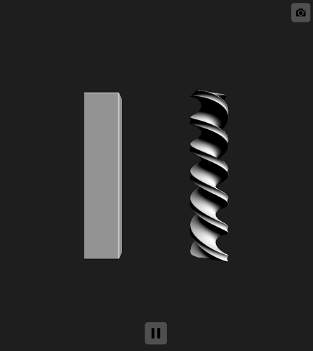
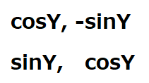

# レイマーチングによるプリミティブの変形  

## プリミティブの変形  

  こちらの資料ではプリミティブの変形に関して少し触れていきます。  
  [こちら](../00_Primitive/README.md)の資料に目を通している前提での説明になるので、まだ目を通していない方は確認していただければと思います。  

  まずそもそもプリミティブの変形と言ってもピンとこない方もいると思うので先に図を提示しておきます。(図00, 図01)  
  プリミティブの変形は合成とは違って様々な実装方法/手法があります。  
  今回紹介するのはあくまで実装イメージをつかむための一例です。  

  図00
    

  図01
    
  
  ではまずは図00のようなプリミティブをでこぼこさせる方法について説明します。  
  今回はコードから見ていきます。  

  ```glsl
  // 距離関数
  float map(vec3 p) {
    float result = MAX_VALUE;  

    float n = 0.85; // でこぼこ係数
    float d1 = dfSphere(p, 10.); // 球体の距離取得
    float d2 = sin(p.x * n) * sin(p.y * n) * sin(p.z * n); // 球体座標からsin値の積を取得
    result = dfCompare(result, (d1 + d2));  

    return result;
  }
  ```

  "n"はでこぼこ具合を表現するための係数です。  
  "d1"は球体の距離関数の結果を取得しています。  
  "d2"はレイ座標"p"の"xyz"成分を"sin"に与えてその積を取得しています。  
  既に想像ついた方もいると思いますが、このコードは座標値各成分の"sin"値の積を距離値に加算しているだけです。  
  ("n"は座標による波の変化具合を変更しているだけですね)  
  頭の中でイメージしていただくとxyzの積が1の時距離は1遠く、積が-1の時は1近くなるのはなんとなく想像つくと思います。  

  では実際に動作するコードを起こしていきます。(結果は図00と同様になれば成功です)  

  ```glsl
#define MAX_VALUE 1e10
#define EPSILON 0.00001
#define MARCHING_LOOP 256

// 球体の距離関数
float dfSphere(vec3 p, float r) {
    return length(p) - r;
}

// 距離比較
float dfCompare(float a, float b) {
    return (a < b) ? a : b;
}

// 距離関数
float map(vec3 p) {
    float result = MAX_VALUE;

    // でこぼこ球体表示
    vec3 sp = p + vec3(-12., 0, 0);
    const float n = 0.85;
    float d1 = dfSphere(sp, 10.);
    float d2 = sin(sp.x * n) * sin(sp.y * n) * sin(sp.z * n);
    result = dfCompare(result, (d1 + d2));
    // 通常の球体表示
    sp = p + vec3(12., 0, 0);
    result = dfCompare(result, dfSphere(sp, 10.));

    return result;
}

// 法線生成関数
vec3 mapNormal(vec3 p) {
    return normalize(
        vec3(
            map(p + vec3(EPSILON, 0.0,     0.0    )) - map(p + vec3(-EPSILON,  0.0,      0.0    )),
            map(p + vec3(0.0,     EPSILON, 0.0    )) - map(p + vec3( 0.0,     -EPSILON,  0.0    )),
            map(p + vec3(0.0,     0.0,     EPSILON)) - map(p + vec3( 0.0,      0.0,      -EPSILON))));
}

// エントリ関数
void mainImage(out vec4 fragColor, in vec2 fragCoord) {
    vec2 pixelPos = (fragCoord.xy * 2. - iResolution.xy) / min(iResolution.x,  iResolution.y); // 原点を画面中心に

    vec3 cameraPos  = vec3( 0.0,  0.0, 30.0);   // カメラ座標
    vec3 cameraDir  = vec3( 0.0,  0.0, -1.0);   // カメラ向き
    vec3 cameraUp   = vec3( 0.0,  1.0,  0.0);   // カメラ上方向ベクトル
    vec3 cameraSide = cross(cameraDir, cameraUp); // 横方向ベクトル

    vec3 lightDir = normalize(vec3(1.0, 1.0, 1.0));
    vec3 lightColor = vec3(1.0);

    // ピクセル座標に対応したレイを生成
    vec3 ray = normalize(cameraSide * pixelPos.x + cameraUp * pixelPos.y + cameraDir);

    float rDistance = 0.0;  // レイの先端座標(rPos)とオブジェクトの距離
    float rLen = 0.0;       // カメラ座標からレイの先端座標までの距離
    vec3 rPos = cameraPos;  // レイの先端座標

    // マーチングループ
    vec4 result = vec4(0.0);
    for (int i = 0; i < MARCHING_LOOP; i++) {
        rPos = cameraPos + ray * rLen;  // レイを伸ばしてレイの先端座標を更新
        rDistance = map(rPos);  // 距離関数でオブジェクトとの距離を取得

        // 衝突判定(距離が0に限りなく近ければ衝突したと判断)
        if (abs(rDistance) < EPSILON) {
            // カラー決定
            result = vec4(max(dot(lightDir, mapNormal(rPos)), 0.0) * lightColor, 1.0);
            break;
        }

        rLen += rDistance;  // レイの長さを更新
    }

    fragColor = result;
}
  ```  

  プリミティブの変形ですが触ってみるとかなり簡単に感じたのではないでしょうか。  
  "sin"に限らず波をとる関数は何でも同じようなことができますし、  
  座標を直接のパラメータとするのではなくて座標をもとにノイズ値を生成して、  
  その値を関数のパラメータとして使えば海面や山肌といったものを表現できるのかなと思います。  
  (作ったことないので想像ですが)  

  では次は図01のプリミティブをねじる方法に関して説明します。  
  まずはコードから見ていきます。  

  ```glsl
  // 距離関数
  float map(vec3 p) {
    float result = MAX_VALUE;  

    // 変形したボックス表示
    float k = 0.6;  // ねじれ係数
    float c = cos(k * p.y);
    float s = sin(k * p.y);
    mat2 m = mat2(c, -s, s, c); // 回転行列生成
    vec2 xz = m * p.xz; // xz座標を回転
    vec3 q = vec3(xz.x, p.y, xz.y);
    result = dfCompare(result, dfBox(q, vec3(3, 15, 1)) - .3);

    return result;
  }
  ```
  
  "k"はねじれ具合を表現するための係数です。  
  "mat2(c, -s, s, c);"ぱっと見だと何かわからないと思いますがよくよく見ると。  
  図02
    
  なんてことない平面上(2次元)の[回転行列](https://ja.wikipedia.org/wiki/%E5%9B%9E%E8%BB%A2%E8%A1%8C%E5%88%97)ですね。  
  これを使用してy値をパラメータとしたxz平面上の回転を行っています。  

  もう上記で答えになっているかと思いますが、  
  単純に座標y値を基準としてレイの座標を回転させているだけです。  
  (y値を基準としたxz平面上の回転をしているので結果はyを軸としてねじれたものになります)

  "- .3"の誤差解消/まるめについて  
  よくよく距離関数の呼び出し部分を見るとボックスの距離関数の結果に-0.3をしていることに気づくと思います。  
  
  ```glsl
  result = dfCompare(result, dfBox(q, vec3(3, 15, 1)) - .3);
  ```
  
  これはレイマーチングの判定を丸めている処理になります。(0.3程度の差であれば衝突していると判断させている)  
  この処理を行うことでプリミティブに丸みを持たせることができます。  

  上記をまとめたコードが下記になります。(正しく動作すれば図01のようになります)  

  ```glsl
#define MAX_VALUE 1e10
#define EPSILON 0.00001
#define MARCHING_LOOP 256

// ボックスの距離関数
float dfBox(vec3 p, vec3 b)
{
    vec3 q = abs(p) - b;
    return  
        length(max(q, 0.0)) +  
        min(max(q.x, max(q.y, q.z)), 0.0);
}

// 距離比較
float dfCompare(float a, float b) {
    return (a < b) ? a : b;
}

// 距離関数
float map(vec3 p) {
    float result = MAX_VALUE;

    // 変形したボックス表示
    vec3 bp = p + vec3(-10., 0, 0);
    const float k = 0.6;
    float c = cos(k * bp.y);
    float s = sin(k * bp.y);
    mat2  m = mat2(c, -s, s, c);
    vec2 xz = m * bp.xz;
    vec3  q = vec3(xz.x, bp.y, xz.y);
    result = dfCompare(result, dfBox(q, vec3(3, 15, 1)) - .3);
    // 通常のボックス表示
    bp = p + vec3(10., 0, 0);
    result = dfCompare(result, dfBox(bp, vec3(3, 15, 1)) - .3);

    return result;
}

// 法線生成関数
vec3 mapNormal(vec3 p) {
    return normalize(
        vec3(
            map(p + vec3(EPSILON, 0.0,     0.0    )) - map(p + vec3(-EPSILON,  0.0,      0.0    )),
            map(p + vec3(0.0,     EPSILON, 0.0    )) - map(p + vec3( 0.0,      -EPSILON,  0.0    )),
            map(p + vec3(0.0,     0.0,     EPSILON)) - map(p + vec3( 0.0,      0.0,     -EPSILON))));
}

// エントリ関数
void mainImage(out vec4 fragColor, in vec2 fragCoord) {
    vec2 pixelPos = (fragCoord.xy * 2. - iResolution.xy) / min(iResolution.x,  iResolution.y); // 原点を画面中心に

    vec3 cameraPos  = vec3( 0.0,  0.0, 30.0);   // カメラ座標
    vec3 cameraDir  = vec3( 0.0,  0.0, -1.0);   // カメラ向き
    vec3 cameraUp   = vec3( 0.0,  1.0,  0.0);   // カメラ上方向ベクトル
    vec3 cameraSide = cross(cameraDir, cameraUp); // 横方向ベクトル

    vec3 lightDir = normalize(vec3(1.0, 1.0, 1.0));
    vec3 lightColor = vec3(1.0);

    // ピクセル座標に対応したレイを生成
    vec3 ray = normalize(cameraSide * pixelPos.x + cameraUp * pixelPos.y + cameraDir);

    float rDistance = 0.0;  // レイの先端座標(rPos)とオブジェクトの距離
    float rLen = 0.0;       // カメラ座標からレイの先端座標までの距離
    vec3 rPos = cameraPos;  // レイの先端座標

    // マーチングループ
    vec4 result = vec4(0.0);
    for (int i = 0; i < MARCHING_LOOP; i++) {
        rPos = cameraPos + ray * rLen;  // レイを伸ばしてレイの先端座標を更新
        rDistance = map(rPos);  // 距離関数でオブジェクトとの距離を取得

        // 衝突判定(距離が0に限りなく近ければ衝突したと判断)
        if (abs(rDistance) < EPSILON) {
            // カラー決定
            result = vec4(max(dot(lightDir, mapNormal(rPos)), 0.0) * lightColor, 1.0);
            break;
        }

        rLen += rDistance;  // レイの長さを更新
    }

    fragColor = result;
}
  ```  

  プリミティブの変形に関してなんとなく雰囲気をつかむことができたのではないでしょうか。  
  レイマーチングは距離判定の際にレイ座標を加工することでプリミティブを様々な形に変形できます。  
  こちらで紹介したのはあくまでも一例なので、興味を持った方はいろいろと調べてみるといい暇つぶしになると思います。  

## 小ネタ  

  プリミティブの変形に使用した係数を"iTime"(経過時間)で変化させると、  
  だんだんと変形する様子が見れるのでちょっと面白い。

```glsl
// 球体の距離関数
float map(vec3 p) {
    float result = MAX_VALUE;

    // でこぼこ球体表示
    vec3 sp = p + vec3(-12., 0, 0);
    float n = sin(iTime * 0.8); // 時間経過で係数変更
    float d1 = dfSphere(sp, 10.);
    float d2 = sin(sp.x * n) * sin(sp.y * n) * sin(sp.z * n);
    result = dfCompare(result, (d1 + d2));
    // 通常の球体表示
    sp = p + vec3(12., 0, 0);
    result = dfCompare(result, dfSphere(sp, 10.));

    return result;
}
```

```glsl
// ボックスの距離関数
float map(vec3 p) {
    float result = MAX_VALUE;

    // 変形したボックス表示
    vec3 bp = p + vec3(-10., 0, 0);
    float k = sin(iTime * 0.8); // 時間経過で係数変更
    float c = cos(k * bp.y);
    float s = sin(k * bp.y);
    mat2  m = mat2(c, -s, s, c);
    vec2 xz = m * bp.xz;
    vec3  q = vec3(xz.x, bp.y, xz.y);
    result = dfCompare(result, dfBox(q, vec3(3, 15, 1)) - .3);
    // 通常のボックス表示
    bp = p + vec3(10., 0, 0);
    result = dfCompare(result, dfBox(bp, vec3(3, 15, 1)) - .3);

    return result;
}
```
