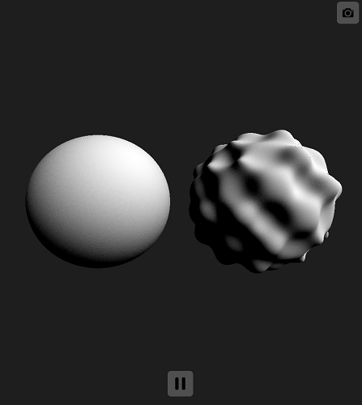

# レイマーチングによるプリミティブの変形と繰り返し  

## プリミティブの変形  

  こちらの資料ではプリミティブの変形に関して少し触れていきます。  
  [こちら](../00_Primitive/README.md)の資料に目を通している前提での説明になるので、まだ目を通していない方は確認していただければと思います。  

  まずそもそもプリミティブの変形とはいったいどういったものなのかわからないと思うので以下の図がイメージになります。  
  プリミティブの変形は合成とは違って、

  図00
    
